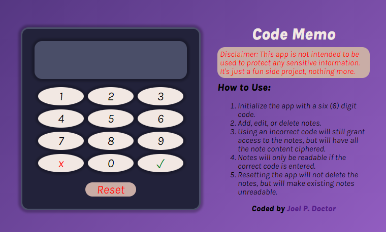

# Code Memo

## A Note App with Some Security

**Disclaimer**

- This app is not intended to be used to protect any sensitive information.
- It uses a very simple cipher to encrypt the notes.
- Due to how it works, anyone who has access to the computer can reset the app or delete, add or edit notes.
- It's just a fun little side project, nothing more.

**End Disclaimer**

This is an app that seeks to replicate the "Code Memo" functionality of old Ericsson phones, specifically the T39 model.

It's basically a note app with some security, though it is obviously not as secure as a true password protected app.

## Table of contents

- [Overview](#overview)
  - [The challenge](#the-challenge)
  - [Screenshots](#screenshots)
  - [Links](#links)
- [My process](#my-process)
  - [Built with](#built-with)
  - [What I learned](#what-i-learned)
  - [Continued development](#continued-development)
  - [Useful resources](#useful-resources)
- [Author](#author)
- [Acknowledgments](#acknowledgments)

## Overview

### The challenge

Users should be able to:

- Initialize the app with a six (6) digit code.
- Add, edit, or delete notes that will be stored in local storage.
- Logout back to the numberpad screen.
- The current passcode is saved in session storage, so it will be asked again if the broswer is closed.
- Using an incorrect code will still grant access to the notes, but will have all the note content ciphered.
- Notes will only be readable if the correct code is entered.
- Resetting the app will not delete the notes, but will make existing notes unreadable.

### Screenshots




### Links

- Live Site URL: https://kingwell47.github.io/code-memo/

## My process

### Built with

- Semantic HTML5 markup
- CSS custom properties
- SCSS
- JavaScript
- Flexbox
- CSS Grid
- Mobile-first workflow
- [React](https://reactjs.org/) - JS library
- [React-spring](https://react-spring.io/) - React animations

### What I learned

Using a simple cipher to encrypt the text before storing it in Local Storage:

```js
export function scrambler(word, number) {
  if (!number) return;
  const min = 33;
  const max = 126;

  const leftOver = number % (max - min);

  return word.replace(/[^\s]/g, (x) => {
    let diff = 0;
    let currentVal = x.charCodeAt(0);
    if (currentVal + leftOver > max) {
      diff = min + currentVal + leftOver - max;
    } else {
      diff = currentVal + leftOver;
    }

    return String.fromCharCode(diff);
  });
}
```

Requiring the passcode to enter the list of notes:

```jsx
<main className='App'>
  {passCode ? (
    <NoteList
      passCode={passCode}
      randomCode={randomCode}
      removePassCode={removePassCode}
    />
  ) : (
    <>
      <GetPasscode
        setPassCode={setPassCode}
        removePassCode={removePassCode}
        randomCode={randomCode}
        getRandomCode={getRandomCode}
        removeRandomCode={removeRandomCode}
      />
      <Instructions />
    </>
  )}
</main>
```

Using React-spring for more animations:

```jsx
{
  transitions(
    (styles, item) =>
      item && (
        <animated.div style={styles}>
          <Note
            note={item}
            key={item.id}
            keyNumber={Math.abs(passCode - randomCode)}
            onEditNote={onEditNote}
            onDeleteNote={onDeleteNote}
          />
        </animated.div>
      )
  );
}
```

### Continued development

I need to improve the cipher to use an actual Encryption Algorithm.

There is also some weirdness with the animations when editing a note, but it ultimately does not affect functionality.

### Useful resources

- [Usefull Custom React Hooks by WebDevSimplified](https://github.com/WebDevSimplified/useful-custom-react-hooks) - Great custom hooks that are easy to implement.
- [Build a Notes App with React.js (for Beginners) by James Grimshaw](https://youtu.be/ulOKYl5sHGk) - A great resource for making a basic notes app.
- [React Notes App Tutorial from Scratch | A CSS and React Project you can add to your Portfolio! by Chris Blakely](https://youtu.be/8KB3DHI-QbM) - Another great tutorial for making a notes app in React.
- [Javascript Coding Challenge #16: Caesars Cipher (Freecodecamp) by whatsdev](https://youtu.be/4mp-6a3vARU) - A tutorial for implementing a simple cipher into the app.

## Author

- Website - [Joel P. Doctor](https://joeldoctor.com/)
- Frontend Mentor - [@kingwell47](https://www.frontendmentor.io/profile/kingwell47)
- Twitter - [@kingwell47](https://www.twitter.com/kingwell47)
- LinkedIn - [Joel P. Doctor](https://www.linkedin.com/in/joel-d-05854919/)

## Acknowledgments

Thanks to Ms. Jessica Chan (Coder Coder) and all the other YouTube creators making their knowledge available!
